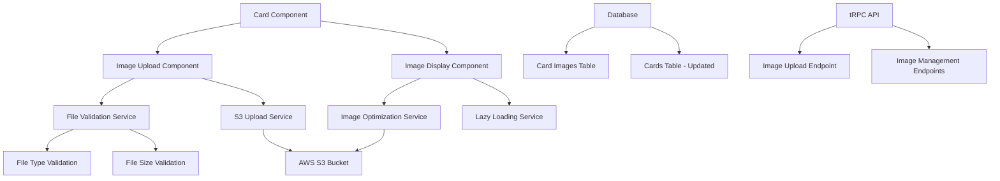

# Design Document

## Overview

This design document outlines the implementation of image functionality for cards in the Kan application. The feature will allow users to upload, display, and manage images within cards, leveraging the existing AWS S3 infrastructure and following the established patterns in the codebase.

The implementation will extend the current card system by adding image storage capabilities, updating the UI components to display images, and providing management interfaces for image operations.

## Architecture

### High-Level Architecture



### Data Flow

1. **Upload Flow**: User selects image → Client validation → S3 upload → Database record creation → UI update
2. **Display Flow**: Card load → Image metadata fetch → Lazy load images → Thumbnail/full-size display
3. **Management Flow**: User action → Confirmation → S3 deletion → Database update → UI refresh

## Components and Interfaces

### Database Schema Extensions

#### New Table: `card_images`

```sql
CREATE TABLE card_images (
  id BIGSERIAL PRIMARY KEY,
  publicId VARCHAR(12) NOT NULL UNIQUE,
  cardId BIGINT NOT NULL REFERENCES card(id) ON DELETE CASCADE,
  filename VARCHAR(255) NOT NULL,
  originalName VARCHAR(255) NOT NULL,
  mimeType VARCHAR(100) NOT NULL,
  fileSize INTEGER NOT NULL,
  s3Key VARCHAR(500) NOT NULL,
  s3Url VARCHAR(1000) NOT NULL,
  thumbnailS3Key VARCHAR(500),
  thumbnailS3Url VARCHAR(1000),
  width INTEGER,
  height INTEGER,
  uploadedBy UUID REFERENCES user(id) ON DELETE SET NULL,
  createdAt TIMESTAMP DEFAULT NOW() NOT NULL,
  deletedAt TIMESTAMP,
  deletedBy UUID REFERENCES user(id) ON DELETE SET NULL
);
```

#### Activity Types Extension

Add new activity types to the existing `activityTypes` array:

- `card.updated.image.added`
- `card.updated.image.removed`
- `card.updated.image.replaced`

### API Interfaces

#### tRPC Router Extensions

```typescript
// New image router
export const imageRouter = createTRPCRouter({
  upload: protectedProcedure
    .input(
      z.object({
        cardPublicId: z.string(),
        filename: z.string(),
        mimeType: z.string(),
        fileSize: z.number(),
      }),
    )
    .mutation(async ({ ctx, input }) => {
      // Generate presigned URL for S3 upload
      // Create database record
      // Return upload URL and image metadata
    }),

  delete: protectedProcedure
    .input(
      z.object({
        imagePublicId: z.string(),
      }),
    )
    .mutation(async ({ ctx, input }) => {
      // Delete from S3
      // Soft delete database record
      // Create activity log
    }),

  getByCard: publicProcedure
    .input(
      z.object({
        cardPublicId: z.string(),
      }),
    )
    .query(async ({ ctx, input }) => {
      // Return all images for a card
    }),
});
```

#### Updated Card Router

```typescript
// Extend existing card.byId to include images
export const cardRouter = createTRPCRouter({
  byId: publicProcedure
    .input(z.object({ publicId: z.string() }))
    .query(async ({ ctx, input }) => {
      // Include images in card query
      // Return card with images array
    }),
  // ... existing methods
});
```

### Frontend Components

#### ImageUpload Component

```typescript
interface ImageUploadProps {
  cardPublicId: string;
  onUploadComplete: (image: CardImage) => void;
  onUploadError: (error: string) => void;
}

export const ImageUpload: React.FC<ImageUploadProps> = ({
  cardPublicId,
  onUploadComplete,
  onUploadError,
}) => {
  // File input handling
  // Client-side validation
  // Progress tracking
  // S3 upload via presigned URL
};
```

#### ImageDisplay Component

```typescript
interface ImageDisplayProps {
  images: CardImage[];
  cardPublicId: string;
  onImageDelete: (imageId: string) => void;
  isEditable?: boolean;
}

export const ImageDisplay: React.FC<ImageDisplayProps> = ({
  images,
  cardPublicId,
  onImageDelete,
  isEditable = false,
}) => {
  // Lazy loading implementation
  // Thumbnail grid display
  // Modal for full-size view
  // Management controls
};
```

#### Updated Card Component

```typescript
// Extend existing Card component to include images
const Card = ({
  title,
  labels,
  members,
  checklists,
  images, // New prop
}: {
  // ... existing props
  images: CardImage[];
}) => {
  // Add image display section
  // Maintain existing layout structure
};
```

## Data Models

### TypeScript Interfaces

```typescript
interface CardImage {
  id: number;
  publicId: string;
  cardId: number;
  filename: string;
  originalName: string;
  mimeType: string;
  fileSize: number;
  s3Key: string;
  s3Url: string;
  thumbnailS3Key?: string;
  thumbnailS3Url?: string;
  width?: number;
  height?: number;
  uploadedBy?: string;
  createdAt: Date;
  deletedAt?: Date;
  deletedBy?: string;
}

interface CardWithImages extends Card {
  images: CardImage[];
}
```

### Validation Schemas

```typescript
export const imageUploadSchema = z.object({
  file: z
    .custom<File>()
    .refine(
      (file) => file.size <= 5 * 1024 * 1024,
      "File size must be under 5MB",
    )
    .refine(
      (file) =>
        ["image/jpeg", "image/png", "image/gif", "image/webp"].includes(
          file.type,
        ),
      "File must be JPEG, PNG, GIF, or WebP",
    ),
  cardPublicId: z.string().min(1),
});
```

## Error Handling

### Client-Side Error Handling

- File validation errors with user-friendly messages
- Upload progress and failure states
- Network error recovery with retry mechanisms
- Graceful degradation when images fail to load

### Server-Side Error Handling

- S3 upload failure handling
- Database transaction rollbacks
- Proper error logging and monitoring
- Rate limiting for upload endpoints

### Error Types

```typescript
enum ImageErrorType {
  INVALID_FILE_TYPE = "INVALID_FILE_TYPE",
  FILE_TOO_LARGE = "FILE_TOO_LARGE",
  UPLOAD_FAILED = "UPLOAD_FAILED",
  STORAGE_ERROR = "STORAGE_ERROR",
  PERMISSION_DENIED = "PERMISSION_DENIED",
}
```

## Testing Strategy

### Unit Tests

- File validation logic
- S3 service methods
- Database repository methods
- Component rendering and interactions

### Integration Tests

- Complete upload flow (client → API → S3 → database)
- Image display and lazy loading
- Error handling scenarios
- Permission and access control

### End-to-End Tests

- User uploads image to card
- Image displays correctly in card view
- Image management (replace/delete) workflows
- Performance under load

### Test Data

- Mock S3 service for unit tests
- Test image files of various formats and sizes
- Database fixtures with image relationships

## Performance Considerations

### Image Optimization

- Automatic thumbnail generation (200x200px for card display)
- WebP conversion for supported browsers
- Progressive JPEG encoding
- Lazy loading with intersection observer

### Caching Strategy

- Browser caching with appropriate headers
- CDN integration via S3 CloudFront
- Client-side image caching
- Database query optimization with proper indexing

### Loading Performance

- Skeleton loading states
- Progressive image loading
- Viewport-based loading priority
- Image preloading for critical images

## Security Considerations

### Upload Security

- File type validation on both client and server
- File size limits enforcement
- Malware scanning integration (future enhancement)
- Presigned URL expiration (15 minutes)

### Access Control

- User permission validation for card access
- S3 bucket policies for secure access
- Image URL access control
- Rate limiting on upload endpoints

### Data Protection

- Secure S3 key generation
- Proper CORS configuration
- HTTPS enforcement for all image URLs
- Audit logging for image operations
